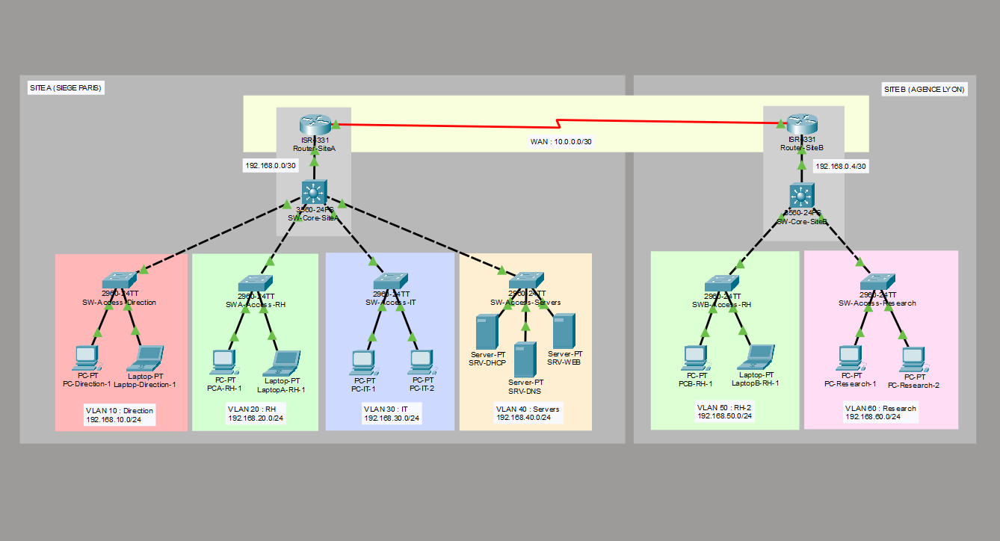

# Redstone Engineering — Projet Réseau Cisco
### Simulation d'une infrastructure réseau d'entreprise multi-sites


---

## 📋 À propos du projet

Ce projet simule l'infrastructure réseau complète de **Redstone Engineering**, une startup fictive spécialisée dans l'hydrogène grand public, réalisé dans le cadre de ma formation **BTS SIO option SISR**.

L'infrastructure couvre **deux sites interconnectés** :
- **Site A — Siège social (Paris)** : pôles Direction, RH, IT et Serveurs
- **Site B — Agence (Lyon)** : pôles RH et Recherche

---

## 🖥️ Topologie



## ⚙️ Compétences mises en place

| Domaine | Technologie | Description |
|---|---|---|
| **Segmentation** | VLANs 802.1Q | 6 VLANs répartis sur 2 sites |
| **Routage L3** | Switch 3560 + SVIs | Routage inter-VLAN sans passer par le routeur |
| **Routage dynamique** | OSPFv2 | Propagation automatique des routes entre sites |
| **Adressage automatique** | DHCP + Relay | Serveur centralisé sur Site A, relay sur Site B |
| **Résolution de noms** | DNS | Enregistrements A pour les serveurs internes |
| **Administration sécurisée** | SSH v2 | Configuré sur les 10 équipements réseau |
| **Sécurité des ports** | Port Security Sticky | Détection et blocage des équipements non autorisés |
| **Filtrage réseau** | ACL étendue | Politique de moindre privilège sur les serveurs |
| **Liaison WAN** | Serial DCE/DTE + OSPF | Interconnexion simulée entre les deux sites |

---

## 🛠️ Technologies utilisées

- **Cisco IOS** — Configuration CLI des équipements
- **Cisco Packet Tracer** — Simulation réseau
- **OSPFv2** — Protocole de routage dynamique
- **802.1Q Trunking** — Transport multi-VLANs

---

## 📁 Structure du projet

```
📦 redstone-engineering-network
 ┣ 📄 README.md              ← Vous êtes ici
 ┣ 📄 documentation.md       ← Documentation technique complète
 ┣ 🖼️ schema.png             ← Schema PNG du réseau
 ┗ 📦 main.pkt               ← Fichier Packet Tracer
```

---

## 📚 Documentation complète

La documentation technique détaillée est disponible dans [documentation.md](./documentation.md).

---

## 👤 Auteur

**Lucas Goulain-Roubanoff**
